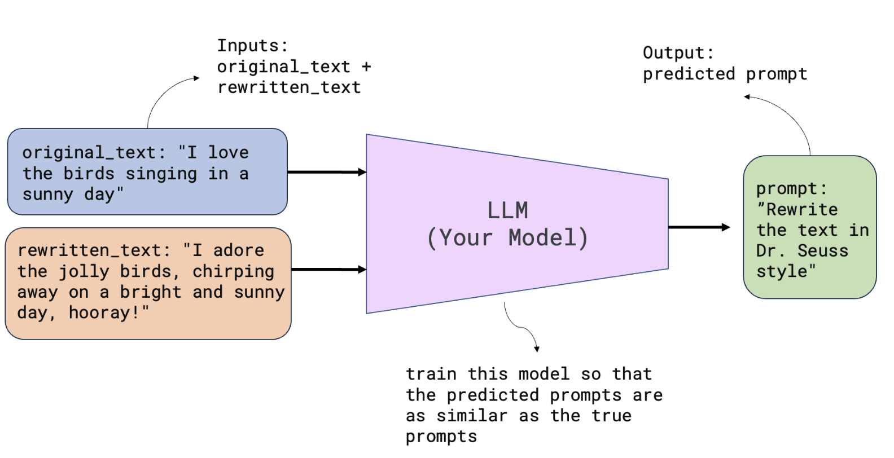

# LLM Prompt Recovery
A presentation on 2024 spring Transformer final project. Significant portion of this project is based on this kaggle competition host by Google: [LLM Prompt Recovery](https://www.kaggle.com/c/llm-prompt-recovery). Collaborated with two friends in college [Kevin Kong](https://github.com/nemonemonee) and [Chuan Shi](https://github.com/shichuanyes).

## Overview
- **Introduction to the task:**
  - Task: Recover the language model prompt used to transform a given text
  - Hidden Dataset: 1300+ original texts paired with rewritten versions generated by Gemma-7b-it LLM
  - Goal: Explore effective machine learning model to predict the instruction prompt used to generate the rewritten text
  - Evaluation: Model performance based on sharpend cosine similarity between predicted and ground truth prompts

- **Three different approaches explored by the group**
  - Instruction finetuning + few-shot approach with Phi-2:
    - Train a decoder model to understand the difference between original and LLM-generated text
  - Dual encoder + decoder model:
    - Capture the information distance between original and rewritten text
    - Apply the embedding to the decoder embedding input
  - T5 Encoder-decoder pretrained model (my approach):
    - Similar to VAE, use the encoder to encode the original text and the rewritten text
    - Use as text-to-text transformer to predict the original prompt 


## Methodology
- **Understanding the task**

Given the origianl text, and a rewrite prompt, the Gemma-7b-it LLM generates a rewritten text.


<p align="center">
  <br>
  <em>Figure: Rewritten Text generation.</em>
</p>

The prompt is not directly available and needs to be recover based on the the original and rewritten text pairs using machine learning models.

<p align="center">
  <br>
  <em>Figure: Recover original prompt with machine learning models.</em>
</p>

And once the predicted prompt is obtained, it can be used to construct a embedding space, and calculate the similarity between the predicted and ground truth prompt using sharpend cosine similarity.

<p align="center">
  <br>
  <em>Figure: Evaluate predicted embedding.</em>
</p>

- **Data Generation**
  - One big challenge we are facing in this competition is the lack of training data. The hidden dataset containes 1300+ original text and rewritten text pairs are only avaliable during our model submission to kaggle. So we need to generate our own training data. 
  - Obtain the original text:
    - Use haggingface datsets
    - Include 100k+ row of original text
    - Include multiple domain of text: news, wikipedia, scientific paper, legal document, etc.
  - Generate prompt:
    - Use ChatGPT and Claude to generate a list of 20+ possible aspects of the rewrite prompt to make prompt.
    - Tested Gemini-1.0-pro api and Prompt engineering to generate the rewrite prompt. 
    - Use Gemma-7b-it local deployment and prompt engineering to generate the text related rewrite prompt.
  - Generate rewritten text:
    - Use Gemma-7b-it local deployment to generate the rewritten text.
    - Use the original text and rewrite prompt to generate the rewritten text.
    - Include 100k+ row of rewritten text.
    - Limit the length of original text and rewritten text to 512 tokens.

- **Modeling**
  - T5 model encoder-decoder architecture:
    - Use the encoder to encode the original text and the rewritten text with a task prefix.
    - Use the decoder to predict the original prompt.
    - Trained using teacher forcing.
    - At inference time, use the encoder hidden state is feed to the decoder via cross-attention and generates auto-regressively the original prompt.
    - Use the Google T5-large model with 775M parameters
    - Use the sharpend cosine similarity to evaluate the predicted prompt

<p align="center">
  <br>
  <em>Figure: Text-to-Text Transfer Transformer(T5).</em>
</p>

- **Training**
  - Use Pytorch Lightning to train the model
  - Use data parallelism to train the model on 8 H100 GPUs
  - Train the model for 10 epochs

## Code Demo

```python
class PromptDataset(Dataset):
    def __init__(self, data, tokenizer, max_source_length, max_target_length):
        self.original_text = data['original_text']
        self.rewritten_text = data['rewritten_text']
        self.prompt_text = data['rewrite_prompt']
        self.tokenizer = tokenizer
        for i in range(len(self.original_text)):
            original_text = self.original_text[i]
            rewritten_text = self.rewritten_text[i]
            prompt_text = str(self.prompt_text[i])
            task_prefix = f"Recover instruction for the text transformation: original text: {original_text}, transformed text: {rewritten_text}"
            encoding =  self.tokenizer(
                task_prefix
            )
            input_ids, attention_mask = encoding.input_ids, encoding.attention_mask
            target_encoding = self.tokenizer(
                prompt_text
            )
            labels = target_encoding.input_ids
            labels[labels == self.tokenizer.pad_token_id] = -100
            self.input_ids.append(input_ids.squeeze())
            self.attention_mask.append(attention_mask.squeeze())
            self.labels.append(labels.squeeze())

    def __getitem__(self, idx):
        return {
            'input_ids': self.input_ids[idx],
            'attention_mask': self.attention_mask[idx],
            'labels': self.labels[idx],
        }

class PromptDecoderLightning(pl.LightningModule):
    def __init__(self, model, tokenizer, max_source_length, max_target_length):
        super().__init__()
        self.model = model
        self.tokenizer = tokenizer
        self.max_source_length = max_source_length
        self.max_target_length = max_target_length

    def forward(self, input_ids, attention_mask, labels):
        outputs = self.model(input_ids=input_ids, attention_mask=attention_mask, labels=labels)
        return outputs.loss

    def training_step(self, batch, batch_idx):
        input_ids = batch['input_ids']
        attention_mask = batch['attention_mask']
        labels = batch['labels']
        loss = self(input_ids, attention_mask, labels)
        return loss

model = T5ForConditionalGeneration.from_pretrained('google/flan-t5-large')
tokenizer = T5Tokenizer.from_pretrained('google/flan-t5-large')

model = PromptDecoderLightning(model, tokenizer, max_source_length, max_target_length)
```

## Evaluation
  - Sharpend Cosine Similarity:
    - Raise the cosine similarity to the power of 3
    - Reported Similarity on validation set (same prompt generating method): 0.72
    - Reported Similarity on validation set (kaggle hidden datasets): 0.61

## Conclusion
- The T5 model encoder-decoder architecture is able to predict the original prompt with a high cosine similarity.
- The model is able to generalize the hidden dataset with a cosine similarity of 0.61. The leaderboard score is 0.71, which is higher than our model's performance.
- But still the scores shows the sign of overfitting to a certain prompt generation method.
  - Our prompt generation method is limited to the local deployment of Gemma-7b-it and free gemini api.
  - Our training data is limited (100k rows, 150Mb text dataset), comparing to the general resources used to train a large language model.
  - We are speculating the leaderboard score is trained with human written prompt, collected from api or other private AI applications.


## Useful links
- Huggingface Demo for Sentence Similarity: [SCS-huggingface-space](https://huggingface.co/spaces/Alberthu233/sentence-t5-prompt-similarity)

- Huggingface T5 model: [T5](https://huggingface.co/docs/transformers/v4.39.3/en/model_doc/t5#transformers.T5Tokenizer)

- Sharphend Cosine Similarity Pytorch: [sharpened-cosine-similarity](https://github.com/brohrer/sharpened-cosine-similarity/tree/main)

- Link to our group repo and source code: [LLM Prompt Recovery](https://github.com/shichuanyes/llm-prompt-recovery/tree/main) (will be available on April 16th)

- Submission notebook with dataset and model checkpoint : [t5-large-inf](https://www.kaggle.com/code/alberthu233/t5-large-inf/notebook) (will be available on April 16th)

## References
Will Lifferth, Paul Mooney, Sohier Dane, Ashley Chow. (2024). LLM Prompt Recovery. Kaggle. https://kaggle.com/competitions/llm-prompt-recovery

Google-Research. (n.d.-a). Google-Research/text-to-text-transfer-transformer: Code for the paper “exploring the limits of transfer learning with a unified text-to-text transformer.” GitHub. https://github.com/google-research/text-to-text-transfer-transformer

Raffel, C., Shazeer, N., Roberts, A., Lee, K., Narang, S., Matena, M., Zhou, Y., Li, W., & Liu, P. J. (2023, September 19). Exploring the limits of transfer learning with a unified text-to-text transformer. arXiv.org. https://arxiv.org/abs/1910.10683

Javaheripi, M., & Bubeck, S. (2023, December 16). Phi-2: The surprising power of small language models. Microsoft Research. https://www.microsoft.com/en-us/research/blog/phi-2-the-surprising-power-of-small-language-models/ 

MOTH. (n.d.). LLM prompt recovery - How This Competition Works. Kaggle. https://www.kaggle.com/competitions/llm-prompt-recovery/discussion/480683 

Brohrer. (n.d.). Brohrer/sharpened-cosine-similarity: An alternative to convolution in Neural Networks. GitHub. https://github.com/brohrer/sharpened-cosine-similarity 